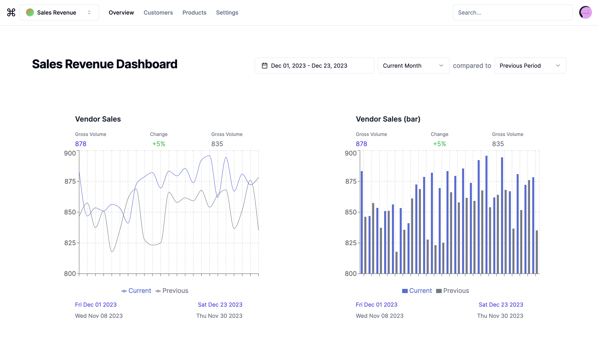

<h1 align="center">
  

  Dashviz
  <br>
</h1>

<h4 align="center">Minimal dynamic dashboard interface for line and bar charts.</h4>
<br>
<p float="left" align="center">
    
    
    
    
    
    
    
    
  </p>

<p align="center">
  <a href="#overview">Overview</a> •
  <a href="#usage">Usage</a>
</p>

## Overview
The available dashboards and their corresponding charts are all defined through 
the database. This means the raw data and the definitions for the views for
this data are all stored in one place, and require zero changes to the source
code to update the content.

<h1 align="center"></h1>

```ts
interface Dashboard {
   name: string,
   id: string,
	 dateFilter: { 
      name: string, 
      initialDateRange: 'LAST_90_DAYS' | 'LAST_30_DAYS' | 'CURRENT_MONTH',
   },
};

interface Chart {
  name: string,
  id: string,
  dashboardName: string,
  chartType: 'line' | 'bar',
  sqlQuery: string,
  xAxisField: string,
  yAxisField: string,
  dateField: { table: string, field: string },
}
```

The tables defined by the above schemas, as well as the raw time series data
itself, are all stored in a single Supabase instance. Each chart instance will
have their own SQL query, table, and field for defining how to query the
correct data. All of these fields used for generating a SQL query is done in
the backend, thus shielding from frontend access.

## Usage

### Frontend
Install npm packages and run in development mode:
  ```bash
  cd frontend
  npm i
  npm run dev
  ```

### Backend
Install npm packages and run server with ts-node:
  ```bash
  cd backend
  npm i
  npx ts-node src/index.ts
  ```

## Database
Won't go into too much detail for setting up Supabase, but most of the tables
used for this project were generated using random data generators like the one
below:

### Dummy Data Generators
```sql
INSERT INTO transactions (id, amount, created_at, description)
SELECT
    md5(random()::text),
    random() * 1000,
    generate_series('2023-01-01'::timestamp, '2023-12-31'::timestamp, '1 day') AS created_at,
    'Description' AS description
```

### Supabase Extensions
Aside from the default extensions, I enabled
[pg_jsonschema](https://github.com/supabase/pg_jsonschema) which enables
JSON schema validation for `json` and `jsonb` data types.
